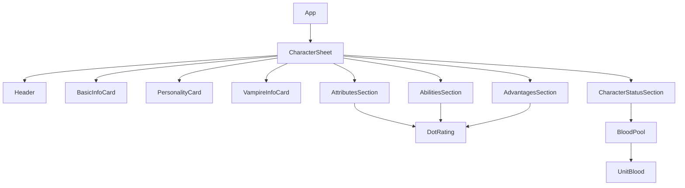
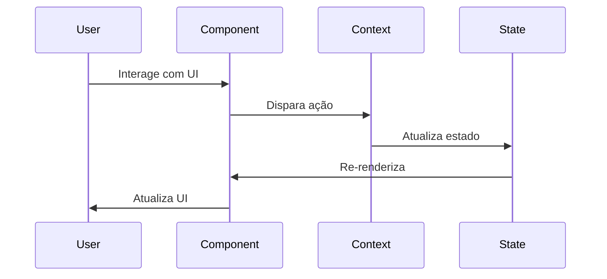
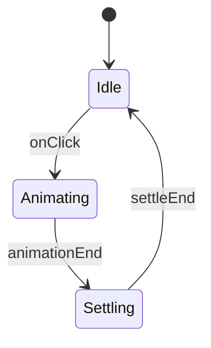
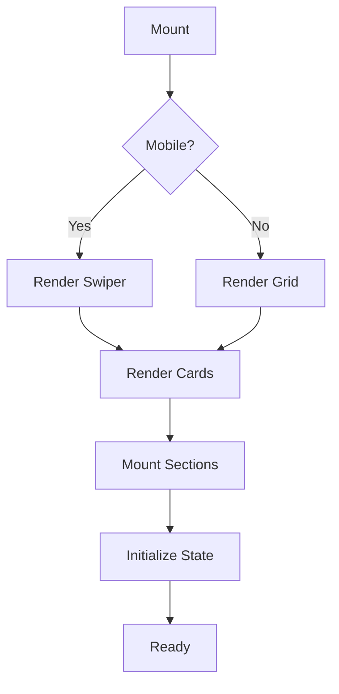

# Arquitetura do Vampire Dark Ages Character Sheet

## 1. Visão Geral

O projeto é uma aplicação React que implementa uma ficha de personagem digital para o RPG Vampire: Dark Ages. A aplicação é estruturada em componentes reutilizáveis e utiliza o Context API do React para gerenciamento de estado.

### 1.1 Tecnologias Principais
- React (Framework principal)
- Material-UI (Componentes e sistema de design)
- Swiper (Carrossel para visualização mobile)
- Context API (Gerenciamento de estado)

## 2. Estrutura de Componentes



### 2.1 Componentes Core

#### CharacterSheet
- **Responsabilidade**: Componente raiz que gerencia o layout geral e o estado do personagem
- **Estado**: 
  - basicInfo (nome, jogador, crônica)
  - personalityInfo (natureza, comportamento, conceito)
  - vampireInfo (clã, geração, senhor, predador)
  - habilidades
  - vantagens (virtudes, antecedentes)
- **Features**:
  - Layout responsivo com Swiper para mobile
  - Gerenciamento de estado centralizado
  - Renderização condicional baseada em viewport

#### BasicInfoCard
- **Responsabilidade**: Gerencia informações básicas do personagem
- **Props**:
  - data: objeto com informações básicas
  - onChange: callback para atualização
- **Estado Local**: Nenhum (Componente controlado)

#### DotRating
- **Responsabilidade**: Componente reutilizável para ratings de 1-5
- **Props**:
  - value: valor atual
  - max: máximo de pontos
  - onChange: callback
  - tooltips: textos de ajuda
  - attributeData: dados do atributo
- **Features**:
  - Sistema de tooltip dinâmico
  - Interação por clique
  - Feedback visual

#### BloodPool
- **Responsabilidade**: Gerencia pontos de sangue do vampiro
- **Props**:
  - max: máximo de pontos
  - perTurn: gasto máximo por turno
- **Features**:
  - Animação de preenchimento
  - Sistema de tooltip
  - Limite de gasto por turno

## 3. Fluxo de Dados



### 3.1 Context API

```javascript
const CharacterContext = {
  character: {
    basicInfo: {},
    personalityInfo: {},
    vampireInfo: {},
    status: {
      bloodPool: {
        current: number,
        max: number
      }
    },
    attributes: {},
    abilities: {},
    advantages: {
      virtues: {},
      backgrounds: []
    }
  },
  updateCharacterInfo: (updates) => void,
  updateBloodPool: (value) => void
}
```

## 4. Lógica de Negócio

### 4.1 Sistema de Pontos
- Atributos: máximo 5 pontos
- Habilidades: máximo 5 pontos
- Blood Pool: máximo configurável, gasto limitado por turno

### 4.2 Validações
- Valores não podem exceder máximo
- Campos obrigatórios não podem ficar vazios
- Gasto de sangue limitado por turno

### 4.3 Animações


## 5. Estilização

### 5.1 Tema Vampírico
```javascript
const vampireTheme = {
  colors: {
    primary: '#8b0000',
    background: '#000000',
    text: '#ffffff'
  },
  effects: {
    overlay: 'linear-gradient(...)',
    shadows: '0 0 8px rgba(139, 0, 0, 0.3)'
  }
}
```

## 6. Performance

### 6.1 Otimizações
- Uso de `memo` em componentes puros
- Callbacks memoizados com `useCallback`
- Valores derivados com `useMemo`
- Componentes de formulário controlados

### 6.2 Call Stack Típico
```
App
└─ CharacterProvider
   └─ CharacterSheet
      ├─ Header
      ├─ BasicInfoCard
      │  └─ MemoizedTextField
      ├─ AttributesSection
      │  └─ DotRating
      └─ BloodPool
         └─ UnitBlood
```

## 7. Fluxo de Renderização



## 8. Considerações de Desenvolvimento

### 8.1 Boas Práticas
- Componentes pequenos e focados
- Reutilização de lógica com hooks
- Separação de concerns
- Props drilling evitado com Context

### 8.2 Áreas de Melhoria
- Implementar testes unitários
- Adicionar documentação de componentes
- Melhorar feedback de erro
- Implementar persistência de dados

## 9. Próximos Passos

### 9.1 Sistema de salvamento
1. Implementar persistência local usando IndexedDB para armazenamento offline
2. Adicionar sistema de exportação de ficha em formato JSON e PDF
3. Criar sistema de backup automático com timestamp
4. Implementar sincronização com serviço de nuvem (opcional)
5. Adicionar sistema de versões para controle de mudanças

### 9.2 Validações mais robustas
1. Implementar validação em tempo real para todos os campos de entrada
2. Adicionar sistema de feedback visual para erros de validação
3. Criar regras de validação específicas para cada tipo de atributo
4. Implementar validação cruzada entre atributos relacionados
5. Adicionar sistema de sugestões para correção de erros

### 9.3 Animações mais fluidas
1. Implementar transições suaves entre estados de componentes
2. Adicionar animações de feedback para interações do usuário
3. Criar efeitos visuais temáticos para ações vampíricas
4. Otimizar performance de animações com CSS transforms
5. Implementar sistema de preferências para redução de movimento

### 9.4 Melhorias de UI/UX
1. Implementar modo escuro/claro com transições suaves
2. Adicionar mais feedbacks táteis e sonoros para interações
3. Melhorar acessibilidade com ARIA labels e keyboard navigation
4. Criar tutoriais interativos para novos usuários
5. Implementar sistema de atalhos de teclado personalizáveis

### 9.5 Expansão de Funcionalidades
1. Adicionar sistema de dados integrado para rolagens
2. Implementar histórico de ações do personagem
3. Criar sistema de notas e anotações integrado
4. Adicionar suporte para múltiplos personagens
5. Implementar sistema de templates de personagens
